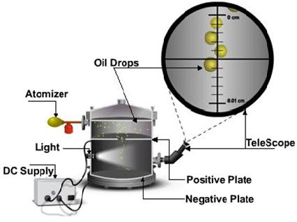
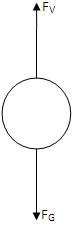
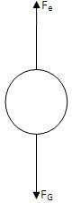
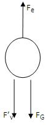

<h2>Construction</h2>

  Oil drop experiment was performed originally by the American physicist <strong>Robert A. Millikan</strong> in 1909.
  It measures the size of charge on a single electron.

  

 

  Apparatus consist of an atomizer, which helps to spray tiny droplets. By means of a short focal distance telescope,
  the droplets can be viewed. There are two plates, one positive and the other negative above and below the bottom chamber.
  A DC supply is attached to the plates. Some of the oil drops fall through the hole in the upper plate.

  Using X-rays the bottom chamber is illuminated causing the air to ionize. As the droplets traverse through the air,
  electrons accumulate over the droplets and negative charge is acquired. With the help of DC supply, a voltage is applied.
  Speed of its motion can be controlled by altering the voltage applied on the plates. By adjusting the voltage applied,
  drop can be suspended in air. Millikan observed one drop after another, varying the voltage and noting the effect.
  After many repetitions he concluded that charge could assume only certain fixed values.

  He repeated the experiment for many droplets and confirmed that the charges were all multiples of some fundamental value
  and calculated it to be <strong>1.5924×10−19 C</strong>, within one percent of the currently accepted value of
  <strong>1.602176487×10−19 C</strong>. He proposed that this was the charge of a single electron.

<h2>Theory</h2>

  Initially the oil drops are allowed to fall between the plates in the absence of electric field. Due to gravity they
  accelerate first, but gradually slow down because of air resistance.

  The terminal velocity <em>v₁</em> in the absence of an electric field is calculated as

$$V_1=\frac{l_1}{t_1}$$

  where <em>l₁</em> is the distance travelled by the oil drop and <em>t₁</em> is the time taken.

  The drag force acting upon the drop is calculated from <strong>Stokes’s law</strong> and is given as:

$$F_v = 6 \pi \eta r v_1$$

  

 

$$F_G = \frac{4}{3} \pi r^3 g (\rho - \rho_{\text{air}})$$

At terminal velocity the oil drop is not accelerating, so the total force acting on it must be zero

$$F_V-F_G=0$$

i.e.,

$$F_V=F_G$$

$$r^2 = \frac{9 \eta v_1}{2g (\rho - \rho_{\text{air}})}$$

<strong>r</strong> – radius of oil drop 
<strong>&eta;</strong> – viscosity of air 
<strong>v₁</strong> – terminal velocity 
<strong>g</strong> – acceleration due to gravity 
<strong>&rho;</strong> – density of liquid 
<strong>&rho;air</strong> – density of air 

  Now a field is produced in the bottom chamber with the supply voltage. A likely looking drop is selected and kept in the
  middle of the field of view by adjusting the voltage.

  

 

  If the electric force <strong>Fe</strong> balances the gravitational force <strong>FG</strong>,
  the drop suspends in the air. Then,

$$F_e=F_G$$

$$qE=mg$$

$$\frac{qV}{d}=mg$$

Here <strong>V</strong> is the balancing potential and <strong>d</strong> is the distance between the plates.

If the applied electric force <strong>Fe</strong> is greater than the downward forces, some of the drops (the charged ones) will start to rise. Now the electric force will act upwards, gravity and viscous forces act downwards.

Corresponding terminal velocity <strong>v₂</strong> is calculated as,

$$V_2=\frac{l_2}{t_2}$$

where <strong>l₂</strong> is the distance travelled by the oil drop and <strong>t₂</strong> the time taken.

Now the total force acting on drop is <strong>Fe - F’v - FG = 0</strong>.

$$F_e=F'_v+F_G$$

  

 

<strong>F’v</strong> is the new viscous force under the action of electric field.

$$qE = 6 \pi \eta r v_2 + 6 \pi \eta r v_1$$
$$\frac{qV}{d} = 6 \pi \eta r (v_1 + v_2)$$
$$q = 6 \pi \eta r (v_1 + v_2) \frac{d}{V}$$

Millikan repeated the experiment a number of times, each time varying the strength of X-rays ionizing the air. 
As a result, the number of electrons attaching to the oil drop varied. 
Then he obtained various values for <i>q</i>, and it was found to be a multiple of 
1.6 &times; 10&minus;19 C.

