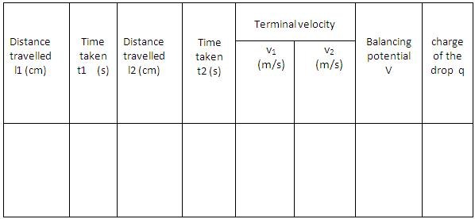

## Procedure

### Apparatus
 

Millikan’s oil drop apparatus, oil, DC supply.

<h3>Procedure for Simulation:</h3>

<ol>
  <li>Click on the <strong>“START”</strong> button.</li>
  <li>Click on the combo box to choose the oil.</li>
  <li>Double click the <strong>“START”</strong> button of the stopwatch and note the time taken <i>t1</i> by a drop to travel distance <i>l1</i> between any two points.</li>
  <li>Click <strong>“Voltage On”</strong> to suspend the same oil drop in air — this is the balancing voltage <i>V</i>.</li>
  <li>Click the <strong>“X-Ray ON”</strong> button and note the time taken <i>t2</i> by the same drop to travel distance <i>l2</i> between any two points.</li>
  <li>The charge of the drop is calculated using the equation:</li>

$$q = \frac{6 \pi \eta r (v_1 + v_2) d}{V}$$

 <li>Repeat the experiment for another oil.  </li>
</ol>

### Observations

 

